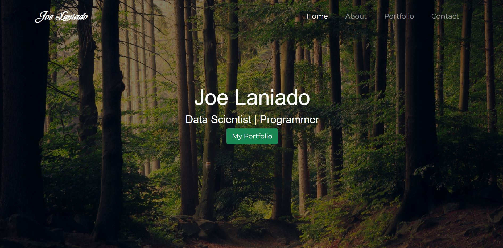

# My Portfolio Website

## Overview
A website that serves both as a project to practice my front-end development skills, and a way to showcase other projects in a user friendly way. It is divided in four sections: Welcome page,
portfolio showcase, about me section, and contact information. Each project showcased has a small description, a list of tools used, a category of skill appplied, and a link to the code, demo,
or a paper depending on the purpose of the task. 

Some of the tools used to build the website are:
* HTML, CSS, and JS
* Bootstrap5 library
* Google fonts API and others. 

This website will keep evolving as I get better at software development and as I implement other projects related to my career. 

## Use
The webpage can be accessed through this link: https://joelaniado.github.io/my-portfolio/ thanks to Github Pages. If you would like to use this portfolio as a template feel free to 
fork the repo and dowloaded to your local machine. 